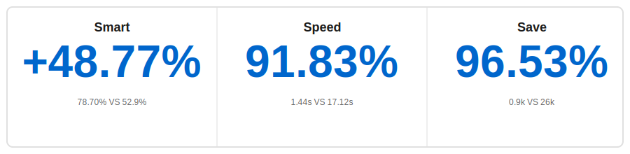

<p align="center">
    <a href="https://github.com/oceanbase/oceanbase">
        
    </a>
</p>

<p align="center">
    <a href="https://pepy.tech/project/powermem">
        
    </a>
    <a href="https://github.com/oceanbase/powermem">
        
    </a>
    <a href="https://pypi.org/project/powermem" target="blank">
        
    </a>
    <a href="https://github.com/oceanbase/powermem/blob/master/LICENSE">
        
    </a>
    <a href="https://img.shields.io/badge/python%20-3.10.0%2B-blue.svg">
        
    </a>
    <a href="https://deepwiki.com/oceanbase/powermem">
        
    </a>
    <a href="https://discord.com/invite/74cF8vbNEs">
        
    </a>
</p>

[English](README.md) | [中文](README_CN.md) | [日本語](README_JP.md)

## ✨ Highlights

<div align="center">



</div>

- 🎯 **Accurate**: **[48.77% Accuracy Improvement]** More accurate than full-context in the LOCOMO benchmark (78.70% VS 52.9%)
- ⚡ **Agile**: **[91.83% Faster Response]** Significantly reduced p95 latency for retrieval compared to full-context (1.44s VS 17.12s)
- 💰 **Affordable**: **[96.53% Token Reduction]** Significantly reduced costs compared to full-context without sacrificing performance (0.9k VS 26k)

# 🧠 PowerMem - Intelligent Memory System

In AI application development, enabling large language models to persistently "remember" historical conversations, user preferences, and contextual information is a core challenge. PowerMem combines a hybrid storage architecture of vector retrieval, full-text search, and graph databases, and introduces the Ebbinghaus forgetting curve theory from cognitive science to build a powerful memory infrastructure for AI applications. The system also provides comprehensive multi-agent support capabilities, including agent memory isolation, cross-agent collaboration and sharing, fine-grained permission control, and privacy protection mechanisms, enabling multiple AI agents to achieve efficient collaboration while maintaining independent memory spaces.

## 🚀 Core Features

### 👨‍💻 Developer Friendly
- 🔌 **[Lightweight Integration](docs/examples/scenario_1_basic_usage.md)**: Provides a simple Python SDK, automatically loads configuration from `.env` files, enabling developers to quickly integrate into existing projects. Also supports [MCP Server](docs/api/0004-mcp.md) and [HTTP API Server](docs/api/0005-api_server.md) integration methods

### 🧠 Intelligent Memory Management
- 🔍 **[Intelligent Memory Extraction](docs/examples/scenario_2_intelligent_memory.md)**: Automatically extracts key facts from conversations through LLM, intelligently detects duplicates, updates conflicting information, and merges related memories to ensure accuracy and consistency of the memory database
- 📉 **[Ebbinghaus Forgetting Curve](docs/examples/scenario_8_ebbinghaus_forgetting_curve.md)**: Based on the memory forgetting patterns from cognitive science, automatically calculates memory retention rates and implements time-decay weighting, prioritizing recent and relevant memories, allowing AI systems to naturally "forget" outdated information like humans

### 👤 User Profile Support
- 🎭 **[User Profile](docs/examples/scenario_9_user_memory.md)**: Automatically builds and updates user profiles based on historical conversations and behavioral data, applicable to scenarios such as personalized recommendations and AI companionship, enabling AI systems to better understand and serve each user

### 🤖 Multi-Agent Support
- 🔐 **[Agent Shared/Isolated Memory](docs/examples/scenario_3_multi_agent.md)**: Provides independent memory spaces for each agent, supports cross-agent memory sharing and collaboration, and enables flexible permission management through scope control

### 🎨 Multimodal Support
- 🖼️ **[Text, Image, and Audio Memory](docs/examples/scenario_7_multimodal.md)**: Automatically converts images and audio to text descriptions for storage, supports retrieval of multimodal mixed content (text + image + audio), enabling AI systems to understand richer contextual information

### 💾 Deeply Optimized Data Storage
- 📦 **[Sub Stores Support](docs/examples/scenario_6_sub_stores.md)**: Implements data partition management through sub stores, supports automatic query routing, significantly improving query performance and resource utilization for ultra-large-scale data
- 🔗 **[Hybrid Retrieval](docs/examples/scenario_2_intelligent_memory.md)**: Combines multi-channel recall capabilities of vector retrieval, full-text search, and graph retrieval, builds knowledge graphs through LLM and supports multi-hop graph traversal for precise retrieval of complex memory relationships

## 🚀 Quick Start

### 📥 Installation

```bash
pip install powermem
```

### 💡 Basic Usage(SDK)

**✨ Simplest Way**: Create memory from `.env` file automatically! [Configuration Reference](.env.example)

```python
from powermem import Memory, auto_config

# Load configuration (auto-loads from .env)
config = auto_config()
# Create memory instance
memory = Memory(config=config)

# Add memory
memory.add("User likes coffee", user_id="user123")

# Search memories
results = memory.search("user preferences", user_id="user123")
for result in results.get('results', []):
    print(f"- {result.get('memory')}")
```

For more detailed examples and usage patterns, see the [Getting Started Guide](docs/guides/0001-getting_started.md).

### 🌐 HTTP API Server

PowerMem also provides a production-ready HTTP API server that exposes all core memory management capabilities through RESTful APIs. This enables any application that supports HTTP calls to integrate PowerMem's intelligent memory system, regardless of programming language.

**Relationship with SDK**: The API server uses the same PowerMem SDK under the hood and shares the same configuration (`.env` file). It provides an HTTP interface to the same memory management features available in the Python SDK, making PowerMem accessible to non-Python applications.

**Starting the API Server**:

```bash
# Method 1: Using CLI command (after pip install)
powermem-server --host 0.0.0.0 --port 8000

# Method 2: Using Docker
# run with Docker
docker run -d \
  --name powermem-server \
  -p 8000:8000 \
  -v $(pwd)/.env:/app/.env:ro \
  --env-file .env \
  oceanbase/powermem-server:latest

# Or use Docker Compose (recommended)
docker-compose -f docker/docker-compose.yml up -d

```

Once started, the API server provides:
- RESTful API endpoints for all memory operations
- Interactive API documentation at `http://localhost:8000/docs`
- API Key authentication and rate limiting support
- Same configuration as SDK (via `.env` file)

For complete API documentation and usage examples, see the [API Server Documentation](docs/api/0005-api_server.md).

### 🔌 MCP Server

PowerMem also provides a Model Context Protocol (MCP) server that enables integration with MCP-compatible clients such as Claude Desktop. The MCP server exposes PowerMem's memory management capabilities through the MCP protocol, allowing AI assistants to access and manage memories seamlessly.

**Relationship with SDK**: The MCP server uses the same PowerMem SDK and shares the same configuration (`.env` file). It provides an MCP interface to the same memory management features, making PowerMem accessible to MCP-compatible AI assistants.

**Installation**:

```bash
# Install PowerMem (required)
pip install powermem

# Install uvx (if not already installed)
# On macOS/Linux:
curl -LsSf https://astral.sh/uv/install.sh | sh

# On Windows:
powershell -c "irm https://astral.sh/uv/install.ps1 | iex"
```

**Starting the MCP Server**:

```bash
# SSE mode (recommended, default port 8000)
uvx powermem-mcp sse

# SSE mode with custom port
uvx powermem-mcp sse 8001

# Stdio mode
uvx powermem-mcp stdio

# Streamable HTTP mode (default port 8000)
uvx powermem-mcp streamable-http

# Streamable HTTP mode with custom port
uvx powermem-mcp streamable-http 8001
```

**Integration with Claude Desktop**:

Add the following configuration to your Claude Desktop config file:

```json
{
  "mcpServers": {
    "powermem": {
      "url": "http://localhost:8000/mcp"
    }
  }
}
```

The MCP server provides tools for memory management including adding, searching, updating, and deleting memories. For complete MCP documentation and usage examples, see the [MCP Server Documentation](docs/api/0004-mcp.md).

## 🔗 Integrations & Demos

- 🔗 **LangChain Integration**: Build medical support chatbot using LangChain + PowerMem + OceanBase, [View Example](examples/langchain/README.md)
- 🔗 **LangGraph Integration**: Build customer service chatbot using LangGraph + PowerMem + OceanBase, [View Example](examples/langgraph/README.md)

## 📚 Documentation

- 📖 **[Getting Started](docs/guides/0001-getting_started.md)**: Installation and quick start guide
- ⚙️ **[Configuration Guide](docs/guides/0003-configuration.md)**: Complete configuration options
- 🤖 **[Multi-Agent Guide](docs/guides/0005-multi_agent.md)**: Multi-agent scenarios and examples
- 🔌 **[Integrations Guide](docs/guides/0009-integrations.md)**: Integrations Guide
- 📦 **[Sub Stores Guide](docs/guides/0006-sub_stores.md)**: Sub stores usage and examples
- 📋 **[API Documentation](docs/api/overview.md)**: Complete API reference
- 🏗️ **[Architecture Guide](docs/architecture/overview.md)**: System architecture and design
- 📓 **[Examples](docs/examples/overview.md)**: Interactive Jupyter notebooks and use cases
- 👨‍💻 **[Development Documentation](docs/development/overview.md)**: Developer documentation

## ⭐ Highlights Release Notes

| Version | Release Date | Function |
|---------|--------------|---------|
| 0.3.0 | 2026.01.09   | <ul><li>Production-ready HTTP API Server with RESTful endpoints for all memory operations</li><li>Docker support for easy deployment and containerization</li></ul> |
| 0.2.0 | 2025.12.16   | <ul><li>Advanced user profile management, supporting "personalized experience" for AI applications</li><li>Expanded multimodal support, including text, image, and audio memory</li></ul> |
| 0.1.0 | 2025.11.14   | <ul><li>Core memory management functionality, supporting persistent storage of memories</li><li>Hybrid retrieval supporting vector, full-text, and graph search</li><li>Intelligent memory extraction based on LLM fact extraction</li><li>Full lifecycle memory management supporting Ebbinghaus forgetting curve</li><li>Multi-Agent memory management support</li><li>Multiple storage backend support (OceanBase, PostgreSQL, SQLite)</li><li>Support for knowledge graph retrieval through multi-hop graph search</li></ul> |

## 💬 Support

- 🐛 **Issue Reporting**: [GitHub Issues](https://github.com/oceanbase/powermem/issues)
- 💭 **Discussions**: [GitHub Discussions](https://github.com/oceanbase/powermem/discussions)

---

## 📄 License

This project is licensed under the Apache License 2.0 - see the [LICENSE](LICENSE) file for details.