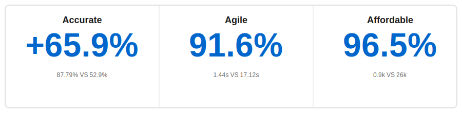

# PowerMem

**Persistent memory for AI agents and applications.**

[](https://pypi.org/project/powermem/)
[](https://pypi.org/project/powermem/)
[](https://pypi.org/project/powermem/)
[](LICENSE)
[](https://github.com/oceanbase/powermem)
[](https://discord.com/invite/74cF8vbNEs)

*English · [中文](README_CN.md) · [日本語](README_JP.md)*

PowerMem combines vector, full-text, and graph retrieval with LLM-driven memory extraction and Ebbinghaus-style time decay. It supports multi-agent isolation, user profiles, and multimodal signals (text, image, audio).

Use the Python SDK, CLI (`pmem`), or the HTTP API Server (with **Dashboard** at `/dashboard/`). An MCP server is also available. All share one `.env`. See [.env.example](.env.example) and the [configuration guide](docs/guides/0003-configuration.md).

## OpenClaw integration

[OpenClaw](https://github.com/openclaw/openclaw) can use PowerMem as long-term memory via the [`memory-powermem`](https://github.com/ob-labs/memory-powermem) plugin.

```bash
openclaw plugins install memory-powermem
```

Requires the OpenClaw CLI to be installed.

<div align="center">


</div>

## Quick start

**Prerequisites:** Copy [.env.example](.env.example) to `.env` and set **LLM** and **embedding** credentials (the default database is SQLite; OceanBase can use **embedded SeekDB** — see `.env.example`). Alternatively, after installing PowerMem, run `pmem config init` to create `.env` interactively. See [Getting started](docs/guides/0001-getting_started.md).

### Install

```bash
# Core only (SDK + storage backends)
pip install powermem

# With CLI (pmem / powermem-cli)
pip install "powermem[cli]"

# With HTTP API server (powermem-server)
pip install "powermem[server]"

# With MCP server (powermem-mcp)
pip install "powermem[mcp]"

# With SeekDB storage backend
pip install "powermem[seekdb]"

# Everything at once
pip install "powermem[cli,server,mcp]"
```

### SDK example

Run from a directory that contains your configured `.env`:

```python
from powermem import Memory, auto_config

config = auto_config()
memory = Memory(config=config)

memory.add("User likes coffee", user_id="user123")

results = memory.search("user preferences", user_id="user123")
for result in results.get("results", []):
    print(f"- {result.get('memory')}")
```

More patterns: [Getting Started](docs/guides/0001-getting_started.md).

### CLI (`pmem`, 1.0+)

```bash
pmem memory add "User prefers dark mode" --user-id user123
pmem memory search "preferences" --user-id user123
```

Interactive REPL (run separately; exits with `exit` or Ctrl+D):

```bash
pmem shell
```

Full reference: [CLI usage](docs/guides/0012-cli_usage.md).

### HTTP API Server and Dashboard

Uses the same `.env` as the SDK. Dashboard is served under `/dashboard/`.

```bash
powermem-server --host 0.0.0.0 --port 8000
```

Use Docker or Compose as needed — see [API Server](docs/api/0005-api_server.md) and [Docker & deployment](docker/README.md).

### Entry points

| Mode | Typical commands | Docs |
|------|------------------|------|
| CLI | `pmem memory add` / `pmem memory search`; `pmem shell` | [CLI usage](docs/guides/0012-cli_usage.md) |
| HTTP + Dashboard | `powermem-server --host 0.0.0.0 --port 8000`; image `oceanbase/powermem-server:latest`; from repo root: `docker-compose -f docker/docker-compose.yml up -d` | [API Server](docs/api/0005-api_server.md) |

<details>
<summary><b>MCP Server</b> (optional)</summary>

Requires [uv](https://docs.astral.sh/uv/) and a configured `.env` in the working directory (see [MCP Server](docs/api/0004-mcp.md)).

```bash
uvx powermem-mcp sse
```

Also supports stdio and streamable-http.

</details>

## Benchmark (LOCOMO)

<div align="center">



</div>

Compared to stuffing full conversation context on [LOCOMO](https://github.com/snap-research/locomo):

| Dimension | Result |
|-----------|--------|
| Accuracy | 78.70% vs. 52.9% |
| Retrieval p95 latency | 1.44s vs. 17.12s |
| Tokens | ~0.9k vs. ~26k |

## Capabilities

**Interfaces and tooling** — [Python integration](docs/examples/scenario_1_basic_usage.md); [CLI](docs/guides/0012-cli_usage.md) (`pmem`); [HTTP API / Dashboard](docs/api/0005-api_server.md); [MCP](docs/api/0004-mcp.md) (optional); [IDE apps](apps/README.md) (VS Code / Cursor, Claude Code, and more).

**Memory pipeline and retrieval** — [Smart extraction and updates](docs/examples/scenario_2_intelligent_memory.md); [Ebbinghaus-style decay](docs/examples/scenario_8_ebbinghaus_forgetting_curve.md); [Hybrid retrieval (vector / full-text / graph)](docs/examples/scenario_2_intelligent_memory.md); [Sub stores and routing](docs/examples/scenario_6_sub_stores.md).

**Profiles and multi-agent** — [User profile](docs/examples/scenario_9_user_memory.md); [Shared / isolated memory and scopes](docs/examples/scenario_3_multi_agent.md).

**Multimodal** — [Text, image, audio](docs/examples/scenario_7_multimodal.md).

## Docs

- [Getting started](docs/guides/0001-getting_started.md) — install, `.env`, and first `Memory` usage
- [Configuration](docs/guides/0003-configuration.md) — settings model, storage backends, environment variables
- [Architecture](docs/architecture/overview.md) — major components, storage layout, and retrieval flow
- [API & services](docs/api/overview.md) — REST, MCP, HTTP server, and Python-facing APIs
- [CLI](docs/guides/0012-cli_usage.md) — `pmem` commands, interactive shell, backup and migration
- [Multi-agent](docs/guides/0005-multi_agent.md) — scopes, isolation, and cross-agent sharing
- [Integrations](docs/guides/0009-integrations.md) — LangChain and other framework wiring
- [Docker & deployment](docker/README.md) — images, Compose, and running the API server
- [Development](docs/development/overview.md) — local setup, tests, and contributing

More topics: [Sub stores](docs/guides/0006-sub_stores.md), [guides index](docs/guides/overview.md).

## Examples

- [Scenarios & notebooks](docs/examples/overview.md) — walkthroughs by use case (basic usage, multimodal, forgetting curve, and more)
- [LangChain sample](examples/langchain/README.md) — medical support chatbot (LangChain + PowerMem + OceanBase)
- [LangGraph sample](examples/langgraph/README.md) — customer service bot (LangGraph + PowerMem + OceanBase)
- [IDE apps](apps/README.md) — VS Code extension and Claude Code plugin (link PowerMem to Cursor, Copilot, etc.)

## Release highlights

| Version | Date | Notes |
|---------|------|--------|
| 1.1.0 | 2026-04-02 | Embedded SeekDB for OceanBase storage without a separate database service; [IDE integrations](apps/README.md) (VS Code extension, Claude Code plugin) |
| 1.0.0 | 2026-03-16 | CLI (`pmem`): memory ops, config, backup/restore/migrate, interactive shell, completions; Web Dashboard |
| 0.5.0 | 2026-02-06 | Unified SDK/API config (pydantic-settings); OceanBase native hybrid search; memory query + list sorting; user-profile language customization |
| 0.4.0 | 2026-01-20 | Sparse vectors for hybrid retrieval; profile-based query rewriting; schema upgrade & migration tools |
| 0.3.0 | 2026-01-09 | Production HTTP API Server; Docker |
| 0.2.0 | 2025-12-16 | Advanced profiles; multimodal (text/image/audio) |
| 0.1.0 | 2025-11-14 | Core memory + hybrid retrieval; LLM extraction; forgetting curve; multi-agent; OceanBase/PostgreSQL/SQLite; graph search |

## Support

- [GitHub Issues](https://github.com/oceanbase/powermem/issues)
- [GitHub Discussions](https://github.com/oceanbase/powermem/discussions)

## License

Apache License 2.0 — see [LICENSE](LICENSE).
