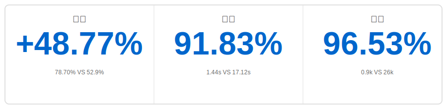

<p align="center">
    <a href="https://github.com/oceanbase/oceanbase">
        
    </a>
</p>

<p align="center">
    <a href="https://pepy.tech/project/powermem">
        
    </a>
    <a href="https://github.com/oceanbase/powermem">
        
    </a>
    <a href="https://pypi.org/project/powermem" target="blank">
        
    </a>
    <a href="https://github.com/oceanbase/powermem/blob/master/LICENSE">
        
    </a>
    <a href="https://img.shields.io/badge/python%20-3.10.0%2B-blue.svg">
        
    </a>
    <a href="https://deepwiki.com/oceanbase/powermem">
        
    </a>
    <a href="https://zread.ai/oceanbase/powermem" target="_blank"></a>
    <a href="https://discord.com/invite/74cF8vbNEs">
        
    </a>
</p>

[English](README.md) | [中文](README_CN.md) | [日本語](README_JP.md)

## ✨ 亮点

<div align="center">



</div>

- 🎯 **更准**：**[准确率提升 48.77%]** 在 LOCOMO 基准测试中，相比于 full-context 更准确（78.70% VS 52.9%）
- ⚡ **更快**：**[响应速度快 91.83%]** 相比于 full-context，检索的 p95 延迟显著降低（1.44s VS 17.12s）
- 💰 **更省**：**[Token 用量降低 96.53%]** 相比于full-context，在不牺牲性能的前提下显著降低成本（0.9k VS 26k）

# 🧠 PowerMem - 智能AI记忆系统

在 AI 应用开发中，如何让大语言模型持久化地"记住"历史对话、用户偏好和上下文信息是一个核心挑战。PowerMem 融合向量检索、全文检索和图数据库的混合存储架构，并引入认知科学的艾宾浩斯遗忘曲线理论，为 AI 应用构建了强大的记忆基础设施。系统还提供完善的多智能体支持能力，包括智能体记忆隔离、跨智能体协作共享、细粒度权限控制和隐私保护机制，让多个 AI 智能体能够在保持独立记忆空间的同时实现高效协作。

## 🚀 核心特性

### 👨‍💻 开发者友好
- 🔌 **[轻量级接入方式](docs/examples/scenario_1_basic_usage.md)**：提供简洁的 Python SDK 支持，自动从 `.env` 文件加载配置，让开发者快速集成到现有项目中。还支持 [MCP Server](docs/api/0004-mcp.md) 和 [HTTP API Server](docs/api/0005-api_server.md) 两种接入方式

### 🧠 智能记忆管理
- 🔍 **[记忆的智能提取](docs/examples/scenario_2_intelligent_memory.md)**：通过 LLM 自动从对话中提取关键事实，智能检测重复、更新冲突信息并合并相关记忆，确保记忆库的准确性和一致性
- 📉 **[艾宾浩斯遗忘曲线](docs/examples/scenario_8_ebbinghaus_forgetting_curve.md)**：基于认知科学的记忆遗忘规律，自动计算记忆保留率并实现时间衰减加权，优先返回最近且相关的记忆，让 AI 系统像人类一样自然"遗忘"过时信息

### 👤 用户画像支持
- 🎭 **[用户画像](docs/examples/scenario_9_user_memory.md)**：基于用户历史对话和行为数据，自动构建和更新用户画像，适用于个性化推荐、AI 陪伴等场景，让 AI 系统更好地理解和服务每个用户

### 🤖 多智能体支持
- 🔐 **[智能体共享/隔离记忆](docs/examples/scenario_3_multi_agent.md)**：为每个智能体提供独立的记忆空间，支持跨智能体记忆共享和协作，通过作用域控制实现灵活的权限管理

### 🎨 多模态支持
- 🖼️ **[文本、图像、语音记忆](docs/examples/scenario_7_multimodal.md)**：自动将图像和音频转换为文本描述并存储，支持多模态混合内容（文本+图像+音频）的检索，让 AI 系统理解更丰富的上下文信息

### 💾 深度优化数据存储
- 📦 **[支持子存储（Sub Stores）](docs/examples/scenario_6_sub_stores.md)**：通过子存储实现数据
的分区管理，支持自动路由查询，显著提升超大规模数据的查询性能和资源利用率
- 🔗 **[混合检索](docs/examples/scenario_2_intelligent_memory.md)**：融合向量检索、全文搜索和图检索的多路召回能力，通过 LLM 构建知识图谱并支持多跳图遍历，精准检索复杂的记忆关联关系

## 🚀 快速开始

### 📥 安装

```bash
pip install powermem
```

### 💡 基本使用（SDK）

**✨ 最简单的方式**：从 `.env` 文件读取配置自动创建记忆！[配置文件参考](.env.example)

```python
from powermem import Memory, auto_config

# 自动从 .env 加载配置并初始化
config = auto_config()
memory = Memory(config=config)

# 添加记忆
memory.add("用户喜欢咖啡", user_id="user123")

# 搜索记忆
results = memory.search("用户偏好", user_id="user123")
for result in results.get('results', []):
    print(f"- {result.get('memory')}")
```

更多详细示例和使用模式，请参阅[入门指南](docs/guides/0001-getting_started.md)。

### 🌐 HTTP API Server

PowerMem 还提供了生产就绪的 HTTP API Server，通过 RESTful API 暴露所有核心记忆管理功能。这使得任何支持 HTTP 调用的应用程序都能集成 PowerMem 的智能记忆系统，无论使用何种编程语言。

**与 SDK 的关系**：API Server底层使用相同的 PowerMem SDK，并共享相同的配置（`.env` 文件）。它提供了与 Python SDK 相同的记忆管理功能的 HTTP 接口，使 PowerMem 可供非 Python 应用程序使用。

**启动 API Server**：

```bash
# 方法 1：使用 CLI 命令（pip 安装后）
powermem-server --host 0.0.0.0 --port 8000

# 方法 2：使用 Docker
# 运行 Docker 容器
docker run -d \
  --name powermem-server \
  -p 8000:8000 \
  -v $(pwd)/.env:/app/.env:ro \
  --env-file .env \
  oceanbase/powermem-server:latest

# 或使用 Docker Compose（推荐）
docker-compose -f docker/docker-compose.yml up -d

```

启动后，API Server提供：
- 所有记忆操作的 RESTful API 端点
- 交互式 API 文档，访问 `http://localhost:8000/docs`
- API Key 认证和限流支持
- 与 SDK 相同的配置（通过 `.env` 文件）

完整的 API 文档和使用示例，请参阅 [API Server文档](docs/api/0005-api_server.md)。

### 🔌 MCP Server

PowerMem 还提供了模型上下文协议（MCP Server），支持与 Claude Desktop 等 MCP 兼容客户端集成。MCP Server通过 MCP 协议暴露 PowerMem 的记忆管理功能，使 AI 助手能够无缝访问和管理记忆。

**与 SDK 的关系**：MCP Server 使用相同的 PowerMem SDK 并共享相同的配置（`.env` 文件）。它提供了与 Python SDK 相同的记忆管理功能的 MCP 接口，使 PowerMem 可供 MCP 兼容的 AI 助手使用。

**安装**：

```bash
# 安装 PowerMem（必需）
pip install powermem

# 安装 uvx（如果尚未安装）
# 在 macOS/Linux 上：
curl -LsSf https://astral.sh/uv/install.sh | sh

# 在 Windows 上：
powershell -c "irm https://astral.sh/uv/install.ps1 | iex"
```

**启动 MCP Server**：

```bash
# SSE 模式（推荐，默认端口 8000）
uvx powermem-mcp sse

# SSE 模式，自定义端口
uvx powermem-mcp sse 8001

# Stdio 模式
uvx powermem-mcp stdio

# Streamable HTTP 模式（默认端口 8000）
uvx powermem-mcp streamable-http

# Streamable HTTP 模式，自定义端口
uvx powermem-mcp streamable-http 8001
```

**与 Claude Desktop 集成**：

在 Claude Desktop 配置文件中添加以下配置：

```json
{
  "mcpServers": {
    "powermem": {
      "url": "http://localhost:8000/mcp"
    }
  }
}
```

MCP Server提供记忆管理工具，包括添加、搜索、更新和删除记忆。完整的 MCP 文档和使用示例，请参阅 [MCP Server文档](docs/api/0004-mcp.md)。

## 🔗 集成与演示

- 🔗 **LangChain 集成**：基于 LangChain + PowerMem + OceanBase 构建医疗支持机器人，[查看示例](examples/langchain/README.md)
- 🔗 **LangGraph 集成**：基于 LangGraph + PowerMem + OceanBase 构建客户服务机器人，[查看示例](examples/langgraph/README.md)

## 📚 文档

- 📖 **[入门指南](docs/guides/0001-getting_started.md)**：安装和快速开始指南
- ⚙️ **[配置指南](docs/guides/0003-configuration.md)**：完整的配置选项
- 🤖 **[多智能体指南](docs/guides/0005-multi_agent.md)**：多智能体场景和示例
- 🔌 **[集成指南](docs/guides/0009-integrations.md)**：集成指南
- 📦 **[子存储指南](docs/guides/0006-sub_stores.md)**：子存储的使用方法和示例
- 📋 **[API 文档](docs/api/overview.md)**：完整的 API 参考
- 🏗️ **[架构指南](docs/architecture/overview.md)**：系统架构和设计
- 📓 **[示例](docs/examples/overview.md)**：交互式 Jupyter 笔记本和使用案例
- 👨‍💻 **[开发者文档](docs/development/overview.md)**：开发者文档

## ⭐ 重点发布说明

| Version | Release Date | Function |
|---------|-------|---------|
| 0.3.0 |  2026.01.09 | <ul><li>生产就绪的 HTTP API Server，提供所有记忆操作的 RESTful 端点</li><li>Docker 支持，便于部署和容器化</li>></ul> |
| 0.2.0 | 2025.12.16 | <ul><li>高级用户画像管理，支持 AI 应用的"千人千面"</li><li>扩展多模态支持，包括文本、图像和音频记忆</li></ul> |
| 0.1.0 | 2025.11.14 | <ul><li>核心记忆管理功能，支持持久化存储记忆</li><li>支持向量、全文和图的混合检索</li><li>基于 LLM 的事实提取智能记忆</li><li>支持基于艾宾浩斯遗忘曲线的全生命周期记忆管理</li><li>支持 Multi-Agent 记忆管理</li><li>多存储后端支持（OceanBase、PostgreSQL、SQLite）</li><li>支持通过多跳图检索的方式处理知识图谱的检索</li></ul> |

## 💬 支持

- 🐛 **问题反馈**：[GitHub Issues](https://github.com/oceanbase/powermem/issues)
- 💭 **讨论交流**：[GitHub Discussions](https://github.com/oceanbase/powermem/discussions)

---

## 📄 许可证

本项目采用 Apache License 2.0 许可证 - 详情请参阅 [LICENSE](LICENSE) 文件。