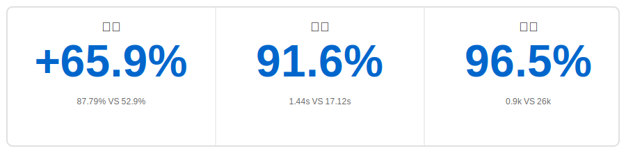

# PowerMem

**面向 AI 应用与智能体的持久化记忆层。**

[](https://pypi.org/project/powermem/)
[](https://pypi.org/project/powermem/)
[](https://pypi.org/project/powermem/)
[](LICENSE)
[](https://github.com/oceanbase/powermem)
[](https://discord.com/invite/74cF8vbNEs)

*[English](README.md) · 中文 · [日本語](README_JP.md)*

PowerMem 融合向量、全文与图检索，支持由 LLM 驱动的记忆抽取与艾宾浩斯型时间衰减，以及多智能体隔离、用户画像和文本/图像/音频等多模态线索。

可通过 Python SDK、CLI（`pmem`）或 HTTP API Server（含 **Dashboard**，路径 `/dashboard/`）接入；亦可使用 MCP Server。共用同一套 `.env`；完整选项见 [.env.example](.env.example) 与 [配置指南](docs/guides/0003-configuration.md)。

## OpenClaw 集成

[OpenClaw](https://github.com/openclaw/openclaw) 可通过插件 [`memory-powermem`](https://github.com/ob-labs/memory-powermem) 将 PowerMem 作为长期记忆使用。

```bash
openclaw plugins install memory-powermem
```

需已安装 OpenClaw CLI。

<div align="center">


</div>

## 快速开始

**前置条件：** 将 [.env.example](.env.example) 复制为 `.env`，并配置 **LLM** 与 **向量嵌入**（默认数据库为 SQLite；OceanBase 可使用 **嵌入式 SeekDB**，见 `.env.example`）。安装 PowerMem 后也可运行 `pmem config init` 交互生成 `.env`。详见 [入门指南](docs/guides/0001-getting_started.md)。

### 安装

```bash
# 仅核心（SDK + 存储后端）
pip install powermem

# 带 CLI（pmem / powermem-cli）
pip install "powermem[cli]"

# 带 HTTP API Server（powermem-server）
pip install "powermem[server]"

# 带 MCP Server（powermem-mcp）
pip install "powermem[mcp]"

# 一次安装全部
pip install "powermem[cli,server,mcp]"
```

### SDK 示例

在包含已配置 `.env` 的目录下运行：

```python
from powermem import Memory, auto_config

config = auto_config()
memory = Memory(config=config)

memory.add("用户喜欢咖啡", user_id="user123")

results = memory.search("用户偏好", user_id="user123")
for result in results.get("results", []):
    print(f"- {result.get('memory')}")
```

更多用法见 [入门指南](docs/guides/0001-getting_started.md)。

### CLI（`pmem`，1.0+）

```bash
pmem memory add "用户偏好深色模式" --user-id user123
pmem memory search "偏好" --user-id user123
```

交互式 Shell（单独执行；用 `exit` 或 Ctrl+D 退出）：

```bash
pmem shell
```

完整说明：[CLI 使用指南](docs/guides/0012-cli_usage.md)。

### HTTP API Server 与 Dashboard

与 SDK 共用同一 `.env`。Dashboard 路径为 `/dashboard/`。

```bash
powermem-server --host 0.0.0.0 --port 8000
```

Docker 与 Compose 等部署方式见 [API Server](docs/api/0005-api_server.md) 与 [Docker 说明](docker/README.md)。

### 接入方式一览

| 方式 | 常用命令 | 文档 |
|------|----------|------|
| CLI | `pmem memory add` / `pmem memory search`；`pmem shell` | [CLI 使用指南](docs/guides/0012-cli_usage.md) |
| HTTP API + Dashboard | `powermem-server --host 0.0.0.0 --port 8000`；镜像 `oceanbase/powermem-server:latest`；在仓库根目录：`docker-compose -f docker/docker-compose.yml up -d` | [API Server](docs/api/0005-api_server.md) |

<details>
<summary><b>MCP Server</b>（可选）</summary>

需要 [uv](https://docs.astral.sh/uv/)，且当前工作目录下需有已配置的 `.env`（见 [MCP Server](docs/api/0004-mcp.md)）。

```bash
uvx powermem-mcp sse
```

另支持 stdio、streamable-http。

</details>

## 基准表现（LOCOMO）

<div align="center">



</div>

相对「全量上下文」基线（[LOCOMO](https://github.com/snap-research/locomo)）：

| 维度 | 结果 |
|------|------|
| 准确率 | 78.70% vs. 52.9% |
| 检索 p95 延迟 | 1.44s vs. 17.12s |
| Token 用量 | 约 0.9k vs. 26k |

## 能力概览

**接入与工程化** — [Python 快速集成](docs/examples/scenario_1_basic_usage.md)；[CLI](docs/guides/0012-cli_usage.md)（`pmem`）；[HTTP API / Dashboard](docs/api/0005-api_server.md)；[MCP](docs/api/0004-mcp.md)（可选）；[IDE 应用](apps/README.md)（VS Code / Cursor、Claude Code 等）。

**记忆管线与检索** — [智能抽取与更新](docs/examples/scenario_2_intelligent_memory.md)；[艾宾浩斯时间衰减](docs/examples/scenario_8_ebbinghaus_forgetting_curve.md)；[混合检索（向量 / 全文 / 图）](docs/examples/scenario_2_intelligent_memory.md)；[子存储与路由](docs/examples/scenario_6_sub_stores.md)。

**用户、画像与多智能体** — [用户画像](docs/examples/scenario_9_user_memory.md)；[共享 / 隔离记忆与作用域](docs/examples/scenario_3_multi_agent.md)。

**多模态** — [文本 / 图像 / 语音](docs/examples/scenario_7_multimodal.md)。

## 文档

- [入门指南](docs/guides/0001-getting_started.md) — 安装、`.env`、首个 `Memory` 用法
- [配置指南](docs/guides/0003-configuration.md) — 配置模型、存储后端、环境变量
- [架构说明](docs/architecture/overview.md) — 组件、存储布局与检索流程
- [API 与服务](docs/api/overview.md) — REST、MCP、HTTP 服务与 Python 侧 API
- [CLI 使用指南](docs/guides/0012-cli_usage.md) — `pmem`、交互 Shell、备份与迁移
- [多智能体](docs/guides/0005-multi_agent.md) — 作用域、隔离与跨智能体共享
- [集成说明](docs/guides/0009-integrations.md) — LangChain 等框架接入
- [Docker 与部署](docker/README.md) — 镜像、Compose、运行 API 服务
- [开发说明](docs/development/overview.md) — 本地开发、测试与贡献

更多：[子存储](docs/guides/0006-sub_stores.md)、[指南索引](docs/guides/overview.md)。

## 示例

- [场景与 Notebook](docs/examples/overview.md) — 按场景分步说明（基础用法、多模态、遗忘曲线等）
- [LangChain 示例](examples/langchain/README.md) — 医疗问答（LangChain + PowerMem + OceanBase）
- [LangGraph 示例](examples/langgraph/README.md) — 客服机器人（LangGraph + PowerMem + OceanBase）
- [IDE 应用](apps/README.md) — VS Code 扩展与 Claude Code 插件（对接 Cursor、Copilot 等）

## 版本要点

| 版本 | 日期 | 说明 |
|------|------|------|
| 1.1.0 | 2026-04-02 | OceanBase 存储支持嵌入式 SeekDB，无需单独部署数据库服务；[IDE 集成](apps/README.md)（VS Code 扩展、Claude Code 插件） |
| 1.0.0 | 2026-03-16 | CLI（`pmem`）：记忆操作、配置、备份/恢复/迁移、交互 Shell、补全；Web Dashboard |
| 0.5.0 | 2026-02-06 | SDK/API 统一配置（pydantic-settings）；OceanBase 原生混合检索；记忆查询与列表排序；用户画像输出语言定制 |
| 0.4.0 | 2026-01-20 | 稀疏向量混合检索；基于画像的查询改写；表结构升级与迁移工具 |
| 0.3.0 | 2026-01-09 | 生产级 HTTP API Server；Docker |
| 0.2.0 | 2025-12-16 | 高级画像；多模态（文本/图像/语音） |
| 0.1.0 | 2025-11-14 | 核心记忆与混合检索；LLM 抽取；遗忘曲线；多智能体；OceanBase/PostgreSQL/SQLite；图检索 |

## 支持

- [GitHub Issues](https://github.com/oceanbase/powermem/issues)
- [GitHub Discussions](https://github.com/oceanbase/powermem/discussions)

## 许可证

Apache License 2.0 — 见 [LICENSE](LICENSE)。
