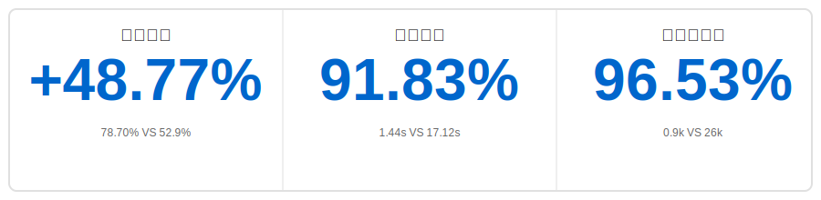

<p align="center">
    <a href="https://github.com/oceanbase/oceanbase">
        
    </a>
</p>

<p align="center">
    <a href="https://pepy.tech/project/powermem">
        
    </a>
    <a href="https://github.com/oceanbase/powermem">
        
    </a>
    <a href="https://pypi.org/project/powermem" target="blank">
        
    </a>
    <a href="https://github.com/oceanbase/powermem/blob/master/LICENSE">
        
    </a>
    <a href="https://img.shields.io/badge/python%20-3.10.0%2B-blue.svg">
        
    </a>
    <a href="https://deepwiki.com/oceanbase/powermem">
        
    </a>
    <a href="https://discord.com/invite/74cF8vbNEs">
        
    </a>
</p>

[English](README.md) | [中文](README_CN.md) | [日本語](README_JP.md)

## ✨ ハイライト

<div align="center">



</div>

- 🎯 **より正確**：**[精度 48.77% 向上]** LOCOMO ベンチマークで full-context より正確（78.70% VS 52.9%）
- ⚡ **より高速**：**[91.83% 高速な応答]** full-context と比較し、検索の p95 遅延が大幅に減少（1.44s VS 17.12s）
- 💰 **より経済的**：**[96.53% トークン削減]** full-context と比較し、性能を犠牲にすることなくコストを大幅に削減（0.9k VS 26k）

# 🧠 PowerMem - インテリジェントメモリシステム

AI アプリケーション開発において、大規模言語モデルが履歴会話、ユーザー設定、コンテキスト情報を永続的に「記憶」できるようにすることは、核心的な課題です。PowerMem は、ベクトル検索、全文検索、グラフデータベースのハイブリッドストレージアーキテクチャを組み合わせ、認知科学のエビングハウス忘却曲線理論を導入して、AI アプリケーション向けの強力なメモリインフラストラクチャを構築します。システムは、エージェントメモリの分離、エージェント間のコラボレーションと共有、きめ細かい権限制御、プライバシー保護メカニズムを含む、包括的なマルチエージェントサポート機能も提供し、複数の AI エージェントが独立したメモリ空間を維持しながら効率的なコラボレーションを実現できるようにします。

## 🚀 核心機能

### 👨‍💻 開発者フレンドリー
- 🔌 **[軽量級アクセス方式](docs/examples/scenario_1_basic_usage.md)**：シンプルな Python SDK プロトコルサポートを提供し、`.env` ファイルから自動的に設定を読み込み、開発者が既存プロジェクトに迅速に統合できるようにします。また、[MCP サーバー](docs/api/0004-mcp.md) と [HTTP API サーバー](docs/api/0005-api_server.md) の 2 つのアクセス方式もサポートしています

### 🧠 インテリジェントメモリ管理
- 🔍 **[メモリのインテリジェント抽出](docs/examples/scenario_2_intelligent_memory.md)**：LLM を通じて会話から重要な事実を自動的に抽出し、重複をインテリジェントに検出し、競合する情報を更新し、関連するメモリをマージして、メモリデータベースの正確性と一貫性を確保します
- 📉 **[エビングハウス忘却曲線](docs/examples/scenario_8_ebbinghaus_forgetting_curve.md)**：認知科学の記憶忘却パターンに基づき、メモリ保持率を自動的に計算し、時間減衰重み付けを実装し、最近かつ関連性の高いメモリを優先的に返し、AI システムが人間のように古い情報を自然に「忘却」できるようにします


### 👤 ユーザープロフィールサポート
- 🎭 **[ユーザープロフィール](docs/examples/scenario_9_user_memory.md)**：ユーザーの履歴会話と行動データに基づいて、ユーザープロフィールを自動的に構築および更新し、パーソナライズされた推奨、AI コンパニオンシップなどのシナリオに適用され、AI システムが各ユーザーをよりよく理解し、サービスを提供できるようにします

### 🤖 マルチエージェントサポート
- 🔐 **[エージェント共有/分離メモリ](docs/examples/scenario_3_multi_agent.md)**：各エージェントに独立したメモリ空間を提供し、エージェント間のメモリ共有とコラボレーションをサポートし、スコープ制御を通じて柔軟な権限管理を実現します

### 🎨 マルチモーダルサポート
- 🖼️ **[テキスト、画像、音声メモリ](docs/examples/scenario_7_multimodal.md)**：画像と音声を自動的にテキスト記述に変換して保存し、マルチモーダル混合コンテンツ（テキスト+画像+音声）の検索をサポートし、AI システムがより豊富なコンテキスト情報を理解できるようにします

### 💾 深く最適化されたデータストレージ
- 📦 **[サブストア（Sub Stores）サポート](docs/examples/scenario_6_sub_stores.md)**：サブストアによるデータのパーティション管理を実装し、自動ルーティングクエリをサポートし、超大规模データのクエリ性能とリソース利用率を大幅に向上させます
- 🔗 **[ハイブリッド検索](docs/examples/scenario_2_intelligent_memory.md)**：ベクトル検索、全文検索、グラフ検索のマルチチャネルリコール機能を融合し、LLM を通じてナレッジグラフを構築し、複雑なメモリ関係を正確に検索するためのマルチホップグラフトラバーサルをサポートします

## 🚀 クイックスタート

### 📥 インストール

```bash
pip install powermem
```

### 💡 基本的な使用方法（SDK）

**✨ 最も簡単な方法**：`.env` ファイルから自動的にメモリを作成！[設定ファイル参照](.env.example)

```python
from powermem import Memory, auto_config

# .env から自動的に読み込む
config = auto_config()
memory = Memory(config=config)

# メモリを追加
memory.add("ユーザーはコーヒーが好き", user_id="user123")

# メモリを検索
results = memory.search("ユーザー設定", user_id="user123")
for result in results.get('results', []):
    print(f"- {result.get('memory')}")
```

より詳細な例と使用パターンについては、[はじめにガイド](docs/guides/0001-getting_started.md) を参照してください。

### 🌐 HTTP API Server

PowerMem は、すべてのコアメモリ管理機能を RESTful API を通じて公開する本番環境対応の HTTP API サーバーも提供します。これにより、HTTP 呼び出しをサポートする任意のアプリケーションが、プログラミング言語に関係なく PowerMem のインテリジェントメモリシステムを統合できます。

**SDK との関係**：API サーバーは、内部で同じ PowerMem SDK を使用し、同じ設定（`.env` ファイル）を共有します。Python SDK で利用可能な同じメモリ管理機能への HTTP インターフェースを提供し、PowerMem を非 Python アプリケーションでも利用可能にします。

**API サーバーの起動**：

```bash
# 方法 1：CLI コマンドを使用（pip インストール後）
powermem-server --host 0.0.0.0 --port 8000

# 方法 2：Docker を使用
# Docker で実行
docker run -d \
  --name powermem-server \
  -p 8000:8000 \
  -v $(pwd)/.env:/app/.env:ro \
  --env-file .env \
  oceanbase/powermem-server:latest

# または Docker Compose を使用（推奨）
docker-compose -f docker/docker-compose.yml up -d

```

起動後、API サーバーは以下を提供します：
- すべてのメモリ操作の RESTful API エンドポイント
- インタラクティブな API ドキュメント、`http://localhost:8000/docs` でアクセス可能
- API Key 認証とレート制限サポート
- SDK と同じ設定（`.env` ファイル経由）

完全な API ドキュメントと使用例については、[API サーバードキュメント](docs/api/0005-api_server.md) を参照してください。

### 🔌 MCP Server

PowerMem は、Claude Desktop などの MCP 互換クライアントとの統合を可能にするモデルコンテキストプロトコル（MCP）サーバーも提供します。MCP サーバーは、MCP プロトコルを通じて PowerMem のメモリ管理機能を公開し、AI アシスタントがシームレスにメモリにアクセスして管理できるようにします。

**SDK との関係**：MCP サーバーは、同じ PowerMem SDK を使用し、同じ設定（`.env` ファイル）を共有します。Python SDK で利用可能な同じメモリ管理機能への MCP インターフェースを提供し、PowerMem を MCP 互換の AI アシスタントでも利用可能にします。

**インストール**：

```bash
# PowerMem をインストール（必須）
pip install powermem

# uvx をインストール（まだインストールされていない場合）
# macOS/Linux の場合：
curl -LsSf https://astral.sh/uv/install.sh | sh

# Windows の場合：
powershell -c "irm https://astral.sh/uv/install.ps1 | iex"
```

**MCP サーバーの起動**：

```bash
# SSE モード（推奨、デフォルトポート 8000）
uvx powermem-mcp sse

# SSE モード、カスタムポート
uvx powermem-mcp sse 8001

# Stdio モード
uvx powermem-mcp stdio

# Streamable HTTP モード（デフォルトポート 8000）
uvx powermem-mcp streamable-http

# Streamable HTTP モード、カスタムポート
uvx powermem-mcp streamable-http 8001
```

**Claude Desktop との統合**：

Claude Desktop 設定ファイルに次の設定を追加します：

```json
{
  "mcpServers": {
    "powermem": {
      "url": "http://localhost:8000/mcp"
    }
  }
}
```

MCP サーバーは、メモリの追加、検索、更新、削除を含むメモリ管理ツールを提供します。完全な MCP ドキュメントと使用例については、[MCP サーバードキュメント](docs/api/0004-mcp.md) を参照してください。

## 🔗 統合とデモ

- 🔗 **LangChain 統合**: LangChain + PowerMem + OceanBase を使用して医療サポートロボットを構築、[例を参照](examples/langchain/README.md)
- 🔗 **LangGraph 統合**: LangGraph + PowerMem + OceanBase を使用してカスタマーサービスロボットを構築、[例を参照](examples/langgraph/README.md)

## 📚 ドキュメント

- 📖 **[はじめに](docs/guides/0001-getting_started.md)**：インストールとクイックスタートガイド
- ⚙️ **[設定ガイド](docs/guides/0003-configuration.md)**：完全な設定オプション
- 🤖 **[マルチエージェントガイド](docs/guides/0005-multi_agent.md)**：マルチエージェントのシナリオと例
- 🔌 **[統合ガイド](docs/guides/0009-integrations.md)**：統合ガイド
- 📦 **[サブストアガイド](docs/guides/0006-sub_stores.md)**：サブストアの使用方法と例
- 📋 **[API ドキュメント](docs/api/overview.md)**：完全な API リファレンス
- 🏗️ **[アーキテクチャガイド](docs/architecture/overview.md)**：システムアーキテクチャと設計
- 📓 **[例](docs/examples/overview.md)**：インタラクティブな Jupyter ノートブックとユースケース
- 👨‍💻 **[開発者ドキュメント](docs/development/overview.md)**：開発者ドキュメント

## ⭐ ハイライト リリースノート

| Version |  Release Date | Function |
|---------|-------|---------|
| 0.3.0 | 2026.01.09 | <ul><li>本番環境対応の HTTP API サーバー、すべてのメモリ操作の RESTful エンドポイントを提供</li><li>Docker サポート、簡単なデプロイとコンテナ化を実現</li></ul> |
| 0.2.0 | 2025.12.16 | <ul><li>高度なユーザープロフィール管理、AI アプリケーションの「千人千面」をサポート</li><li>テキスト、画像、音声メモリを含む拡張マルチモーダルサポート</li></ul> |
| 0.1.0 | 2025.11.14 | <ul><li>コアメモリ管理機能、メモリの永続ストレージをサポート</li><li>ベクトル、全文、グラフ検索をサポートするハイブリッド検索</li><li>LLM ベースの事実抽出によるインテリジェントメモリ抽出</li><li>エビングハウス忘却曲線に基づく全ライフサイクルメモリ管理をサポート</li><li>Multi-Agent メモリ管理をサポート</li><li>複数のストレージバックエンドサポート（OceanBase、PostgreSQL、SQLite）</li><li>マルチホップグラフ検索による知識グラフの検索処理をサポート</li></ul> |


## 💬 サポート

- 🐛 **問題フィードバック**：[GitHub Issues](https://github.com/oceanbase/powermem/issues)
- 💭 **ディスカッション交流**：[GitHub Discussions](https://github.com/oceanbase/powermem/discussions)

---

## 📄 ライセンス

このプロジェクトは Apache License 2.0 の下でライセンスされています - 詳細については [LICENSE](LICENSE) ファイルを参照してください。

