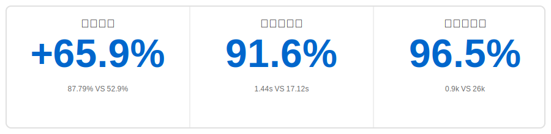

# PowerMem

**AI アプリケーションとエージェント向けの永続メモリ層。**

[](https://pypi.org/project/powermem/)
[](https://pypi.org/project/powermem/)
[](https://pypi.org/project/powermem/)
[](LICENSE)
[](https://github.com/oceanbase/powermem)
[](https://discord.com/invite/74cF8vbNEs)

*[English](README.md) · [中文](README_CN.md) · 日本語*

PowerMem はベクトル・全文・グラフ検索に加え、LLM によるメモリ抽出とエビングハウス型の時間減衰、マルチエージェント分離、ユーザープロフィール、テキスト・画像・音声などのマルチモーダル手がかりを扱います。

Python SDK、CLI（`pmem`）、HTTP API Server（**Dashboard** は `/dashboard/`）、または MCP Server で利用できます。いずれも同一の `.env` を共有します。[.env.example](.env.example) と [設定ガイド](docs/guides/0003-configuration.md) を参照してください。

## OpenClaw 連携

[OpenClaw](https://github.com/openclaw/openclaw) はプラグイン [`memory-powermem`](https://github.com/ob-labs/memory-powermem) により PowerMem を長期メモリとして利用できます。

```bash
openclaw plugins install memory-powermem
```

OpenClaw CLI がインストール済みである必要があります。

<div align="center">


</div>

## クイックスタート

**前提:** [.env.example](.env.example) を `.env` にコピーし、**LLM** と **埋め込み（embedding）** を設定してください（デフォルト DB は SQLite。OceanBase では **埋め込み SeekDB** を利用可能 — `.env.example` 参照）。インストール後は `pmem config init` で対話的に `.env` を作成することもできます。詳しくは [はじめに](docs/guides/0001-getting_started.md) を参照してください。

### インストール

```bash
# コアのみ（SDK + ストレージバックエンド）
pip install powermem

# CLI付き（pmem / powermem-cli）
pip install "powermem[cli]"

# HTTP API Server付き（powermem-server）
pip install "powermem[server]"

# MCP Server付き（powermem-mcp）
pip install "powermem[mcp]"

# SeekDB ストレージバックエンド付き
pip install "powermem[seekdb]"

# すべてまとめてインストール
pip install "powermem[cli,server,mcp]"
```

### SDK サンプル

設定済みの `.env` があるディレクトリで実行します。

```python
from powermem import Memory, auto_config

config = auto_config()
memory = Memory(config=config)

memory.add("ユーザーはコーヒーが好き", user_id="user123")

results = memory.search("ユーザー設定", user_id="user123")
for result in results.get("results", []):
    print(f"- {result.get('memory')}")
```

詳細は [はじめに](docs/guides/0001-getting_started.md) を参照してください。

### CLI（`pmem`、1.0+）

```bash
pmem memory add "ユーザーはダークモードを好む" --user-id user123
pmem memory search "設定" --user-id user123
```

対話シェル（別途実行。`exit` または Ctrl+D で終了）：

```bash
pmem shell
```

詳細は [CLI 使用ガイド](docs/guides/0012-cli_usage.md) を参照してください。

### HTTP API Server と Dashboard

SDK と同じ `.env` を使用します。Dashboard は `/dashboard/` です。

```bash
powermem-server --host 0.0.0.0 --port 8000
```

Docker や Compose については [API Server](docs/api/0005-api_server.md) と [Docker README](docker/README.md) を参照してください。

### 利用形態一覧

| 形態 | 代表的なコマンド | ドキュメント |
|------|------------------|--------------|
| CLI | `pmem memory add` / `pmem memory search`；`pmem shell` | [CLI 使用ガイド](docs/guides/0012-cli_usage.md) |
| HTTP + Dashboard | `powermem-server --host 0.0.0.0 --port 8000`；イメージ `oceanbase/powermem-server:latest`；リポジトリルートで：`docker-compose -f docker/docker-compose.yml up -d` | [API Server](docs/api/0005-api_server.md) |

<details>
<summary><b>MCP Server</b>（任意）</summary>

[uv](https://docs.astral.sh/uv/) と、作業ディレクトリに設定済みの `.env` が必要です（[MCP Server](docs/api/0004-mcp.md)）。

```bash
uvx powermem-mcp sse
```

stdio / streamable-http にも対応。

</details>

## ベンチマーク（LOCOMO）

<div align="center">



</div>

会話全文をコンテキストに載せる方式との比較（[LOCOMO](https://github.com/snap-research/locomo)）：

| 観点 | 結果 |
|------|------|
| 精度 | 78.70% vs. 52.9% |
| 検索 p95 遅延 | 1.44s vs. 17.12s |
| トークン | 約 0.9k vs. 26k |

## 機能概要

**インターフェースとツール** — [Python 統合](docs/examples/scenario_1_basic_usage.md)；[CLI](docs/guides/0012-cli_usage.md)（`pmem`）；[HTTP API / Dashboard](docs/api/0005-api_server.md)；[MCP](docs/api/0004-mcp.md)（任意）；[IDE アプリ](apps/README.md)（VS Code / Cursor、Claude Code など）。

**メモリパイプラインと検索** — [スマート抽出と更新](docs/examples/scenario_2_intelligent_memory.md)；[エビングハウス型減衰](docs/examples/scenario_8_ebbinghaus_forgetting_curve.md)；[ハイブリッド検索（ベクトル / 全文 / グラフ）](docs/examples/scenario_2_intelligent_memory.md)；[サブストアとルーティング](docs/examples/scenario_6_sub_stores.md)。

**プロフィールとマルチエージェント** — [ユーザープロフィール](docs/examples/scenario_9_user_memory.md)；[共有 / 分離メモリとスコープ](docs/examples/scenario_3_multi_agent.md)。

**マルチモーダル** — [テキスト・画像・音声](docs/examples/scenario_7_multimodal.md)。

## ドキュメント

- [はじめに](docs/guides/0001-getting_started.md) — インストール、`.env`、最初の `Memory` 利用
- [設定](docs/guides/0003-configuration.md) — 設定モデル、ストレージバックエンド、環境変数
- [アーキテクチャ](docs/architecture/overview.md) — 主要コンポーネント、ストレージ構成、検索の流れ
- [API とサービス](docs/api/overview.md) — REST、MCP、HTTP サーバー、Python 向け API
- [CLI](docs/guides/0012-cli_usage.md) — `pmem` コマンド、対話シェル、バックアップとマイグレーション
- [マルチエージェント](docs/guides/0005-multi_agent.md) — スコープ、分離、エージェント間共有
- [統合](docs/guides/0009-integrations.md) — LangChain などフレームワーク連携
- [Docker とデプロイ](docker/README.md) — イメージ、Compose、API サーバーの実行
- [開発](docs/development/overview.md) — ローカル環境、テスト、コントリビューション

その他：[サブストア](docs/guides/0006-sub_stores.md)、[ガイド一覧](docs/guides/overview.md)。

## サンプル

- [シナリオと Notebook](docs/examples/overview.md) — ユースケース別の手順とノート（基本、マルチモーダル、忘却曲線など）
- [LangChain サンプル](examples/langchain/README.md) — 医療サポートチャットボット（LangChain + PowerMem + OceanBase）
- [LangGraph サンプル](examples/langgraph/README.md) — カスタマーサービスボット（LangGraph + PowerMem + OceanBase）
- [IDE アプリ](apps/README.md) — VS Code 拡張と Claude Code プラグイン（Cursor、Copilot などと連携）

## リリースハイライト

| バージョン | 日付 | 内容 |
|------------|------|------|
| 1.1.0 | 2026-04-02 | OceanBase 向けに埋め込み SeekDB（別途 DB サービス不要）；[IDE 連携](apps/README.md)（VS Code 拡張、Claude Code プラグイン） |
| 1.0.0 | 2026-03-16 | CLI（`pmem`）：メモリ操作、設定、バックアップ/復元/マイグレーション、対話シェル、補完；Web Dashboard |
| 0.5.0 | 2026-02-06 | SDK/API 設定の統一（pydantic-settings）；OceanBase native hybrid search；Memory クエリと一覧ソート；プロフィールの言語カスタマイズ |
| 0.4.0 | 2026-01-20 | スパースベクトル混合検索；プロフィール起点のクエリ書き換え；スキーマ更新と移行ツール |
| 0.3.0 | 2026-01-09 | 本番向け HTTP API Server；Docker |
| 0.2.0 | 2025-12-16 | プロフィール強化；マルチモーダル（テキスト/画像/音声） |
| 0.1.0 | 2025-11-14 | コアメモリとハイブリッド検索；LLM 抽出；忘却曲線；マルチエージェント；OceanBase/PostgreSQL/SQLite；グラフ検索 |

## サポート

- [GitHub Issues](https://github.com/oceanbase/powermem/issues)
- [GitHub Discussions](https://github.com/oceanbase/powermem/discussions)

## ライセンス

Apache License 2.0 — 詳細は [LICENSE](LICENSE)。
